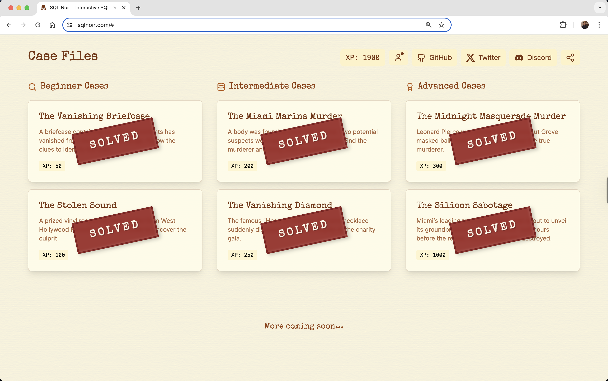

# SQLNoir

SQL Noir is a game that makes practicing SQL fun!

🕵️‍♂️ You play as a detective solving crimes with SQL queries. Each case has realistic databases with suspects, evidence, and witness interviews.

This code repository contains the solutions to all riddles.

## Riddles

1. [The Vanished Briefcase](riddles/1_The_Vanished_Briefcase.md)
2. [The Stolen Sound](riddles/2_The_Stolen_Sound.md)
3. [The Miami Marina Murder](riddles/3_The_Miami_Marina_Murder.md)
4. [The Vanishing Diamond](riddles/4_The_Vanishing_Diamond.md)
5. [The Midnight Masquerade Murder](riddles/5_The_Midnight_Masquerade_Murder.md)
6. [The Silocon Sabotage](riddles/6_The_Silocon_Sabotage.md)
