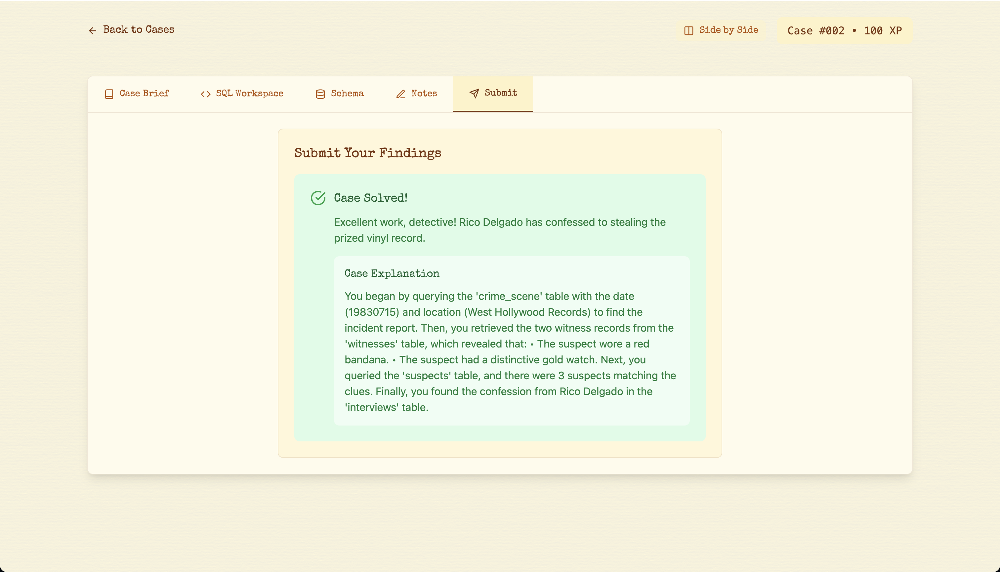

# 🕵️‍♂️ Case #002: The Stolen Sound

## 🔍 Summary



```sql
SELECT *
FROM witnesses w
JOIN crime_scene cs
ON w.crime_scene_id = cs.id
WHERE cs.date="19830715"

```

I saw a man wearing a red bandana rushing out of the store.

The main thing I remember is that he had a distinctive gold watch on his wrist.

```sql
SELECT *
FROM suspects s
JOIN interviews i
ON s.id=i.suspect_id
WHERE s.bandana_color="red"
AND s.accessory="gold watch"
```
