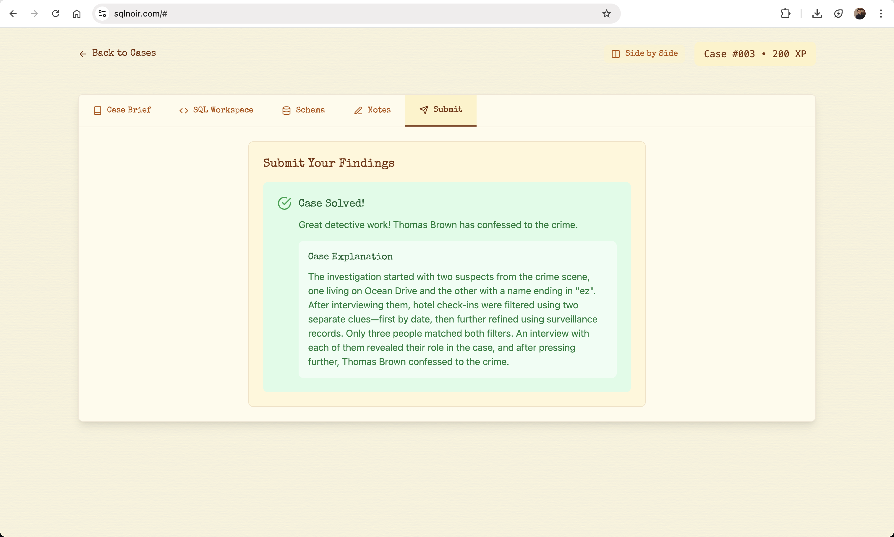

# **🕵️‍♂️ Case #008: Death at Coral Bay Marina**

* **Date:** August 14, 1986
* **Location:** Coral Bay Marina
* **Victim:** Unidentified male body found floating near the docks at dawn.
* **Objective:** Uncover who murdered the victim and how.
* **Tools:** SQL JOINs, wildcard searches, logical deduction.

## **🗂️ Database Tables Used**

1. crime_scene
2. person
3. interviews
4. hotel_checkins
5. surveillance_records
6. confessions

## **🔍 Summary**



## **🚢 Step 1: Crime Scene Overview**

```sql
SELECT *
FROM crime_scene
WHERE location LIKE "Coral Bay Marina";
```

**Clues:**

* Unidentified body discovered at the docks.
* Two people were spotted near the scene:
  * One who lives at a “300-ish” Ocean Drive address.
  * Another whose **first name ends in “ul”** and **last name ends in “ez”**.

## **🏠 Step 2: Identify the Local Resident**

```sql
SELECT *
FROM person
WHERE address LIKE "3__ Ocean Drive%";
```

**Match:**

* 101 | Carlos Mendez | Los Ojos | Fisherman | 369 Ocean Drive

## **🕵️ Step 3: Identify the Person by Name Pattern**

```sql
SELECT *
FROM person
WHERE name LIKE "%ul %ez";
```

**Match:**

* 102 | Raul Gutierrez | The Cobra | Nightclub Owner | 45 Sunset Ave

## **🎤 Step 4: Interview Suspects**

```sql
SELECT *
FROM interviews
WHERE person_id IN (101, 102);
```

**Clues:**

* Carlos Mendez: *“I saw someone check into a hotel on August 13. He looked nervous.”*
* Raul Gutierrez: *“I heard someone checked into a hotel with ‘Sunset’ in the name.”*

## **🏨 Step 5: Investigate the Hotel Check-in**

```sql
SELECT *
FROM hotel_checkins
WHERE hotel_name LIKE "%Sunset%"
AND check_in_date = "19860813";
```

## **🔍 Step 6: Tie Together Hotel, Surveillance, Confession, Identity**

```sql
SELECT *
FROM hotel_checkins hc
JOIN surveillance_records sr ON hc.person_id = sr.person_id
JOIN confessions c ON hc.person_id = c.person_id
JOIN person p ON hc.person_id = p.id
WHERE hc.hotel_name LIKE "%Sunset%"
  AND hc.check_in_date = "19860813"
  AND sr.suspicious_activity IS NOT NULL;
```

**Match Found:**

* **Hotel:** Sunset Palm Resort
* **Check-in Date:** August 13, 1986
* **Suspicious Behavior:** *Left suddenly at 3 AM*
* **Confession:** *“Alright! I did it. I was paid to make sure he never left the marina alive.”*

## **✅ Conclusion**

* **Killer Identified:** 🧍‍♂️ Person ID 73 (name revealed in person table)
* **Motive:** Paid hit
* **Confession Given:** Yes
* **Status:** Case closed
