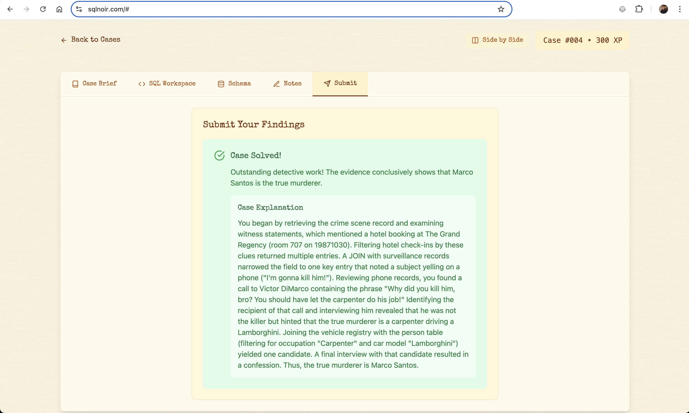

# 🕵️‍♂️ Case #004: The Vanishing Diamond

At Miami’s prestigious Fontainebleau Hotel charity gala, the famous “Heart of Atlantis” diamond necklace suddenly disappeared from its display.

* **Date:** May 20, 1987
* **Location:** Fontainebleau Hotel
* **Victim:** Heart of Atlantis necklace
* **Objective:** Uncover who stole the diamond necklace.

## 🔍 Summary



## **🔍 Step 1: Get Witness Statements from Crime Scene**

```sql
SELECT *
FROM crime_scene
WHERE location LIKE "%Fontainebleau%"

```

* **Clues:**

* Many guests were questioned but only two of them gave valuable clues.
* One of them is a really famous actor.
* The other one is a woman who works as a consultant for a big company and her first name ends with "an".

## **🔍 Step 2: Identify the Suspects**

```sql
SELECT *
FROM guest
WHERE occupation="Actor"
OR (occupation="Consultant" AND name LIKE "%an %")

```

* **Match:**

* 116, Vivian Nair, Consultant, VIP-R
* 129, Clint Eastwood, Actor, VIP-G

## **🔍 Step 3: Investigate the Witness Statements**

```sql
SELECT *
FROM witness_statements w
JOIN guest g
ON w.guest_id = g.id
WHERE occupation="Actor"
OR (occupation="Consultant" AND name LIKE "%an %")

```

* **Clue:**

* I saw someone holding an invitation ending with "-R". He was wearing a navy suit and a white tie.
* I overheard someone say, "Meet me at the marina, dock 3.

```sql
SELECT *
FROM attire_registry ar
JOIN marina_rentals mr
ON ar.guest_id = mr.renter_guest_id
JOIN guest g
ON ar.guest_id = g.id
JOIN final_interviews fi
ON g.id = fi.guest_id
WHERE ar.note LIKE "%navy suit, white tie%"
AND mr.dock_number=3
AND mr.rental_date="19870520"
AND g.invitation_code LIKE "%R"

```

* **Match:**

* 105  Mike Manning

## **✅ Conclusion**

* **Murderer Identified:** 🧍‍♂️ **Mike Manning**

* **Role:** Actor who stole the diamond necklace.
