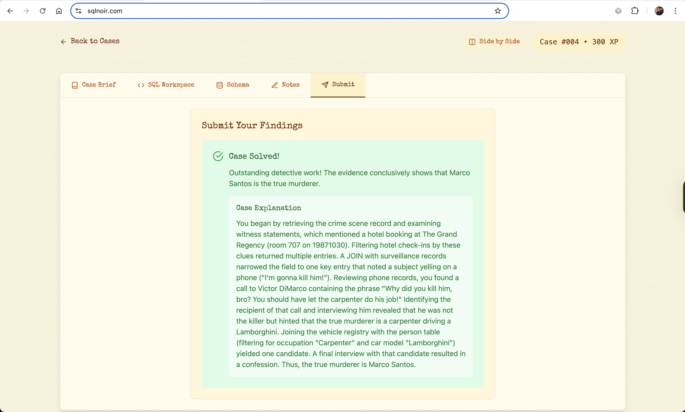

# 🕵️‍♂️ Case #005: The Midnight Masquerade Murder

* **Date:** October 31, 1987
* **Location:** Mansion in Coconut Grove
* **Victim:** Leonard Pierce (found dead in the garden during a masked ball)
* **Objective:** Use SQL queries to uncover who killed Leonard Pierce.

## 🗂️ Database Tables Used

1. crime_scene
2. person
3. witness_statements
4. hotel_checkins
5. surveillance_records
6. phone_records
7. final_interviews
8. vehicle_registry
9. catering_orders

## 🔍 Summary



## **🔍 Step 1: Get Witness Statements from Crime Scene**

```sql
SELECT c.id, c.location, w.*
FROM crime_scene c
JOIN witness_statements w ON c.id = w.crime_scene_id
WHERE c.location LIKE "%mansion, coconut grove%";
```

**Clues:**

* Murder took place during a masked ball.
* Body found in the garden.
* Witnesses mentioned:
  * A hotel booking at **The Grand Regency**
  * A reservation for **Room 707**
  * Suspicious **phone activity**

## **🏨 Step 2: Check Hotel + Surveillance + Final Interviews**

```sql
SELECT *
FROM hotel_checkins h
JOIN surveillance_records s ON h.id = s.hotel_checkin_id
JOIN final_interviews f ON h.person_id = f.person_id
WHERE check_in_date = "19871030"
  AND hotel_name LIKE "The Grand Regency"
  AND room_number = 707
  AND note IS NOT NULL;
```

**Clues:**

* Someone was overheard yelling on the phone: *“Did you kill him?”*
* Identified person: person_id = 11

## **📞 Step 3: Investigate Phone Records of Person 11**

```sql
SELECT *
FROM phone_records
WHERE caller_id = 11
   OR recipient_id = 11;
```

**Clue:**

* Someone said: *“Why did you kill him, bro? You should have let the carpenter do it himself!”*

## **🧍 Step 4: Interrogate the Person on the Call (Middleman)**

```sql
SELECT *
FROM final_interviews f
JOIN person p ON f.person_id = p.id
WHERE f.person_id = 58;
```

**Clue:**

* *“I didn’t kill Leo per se. I was just a middleman.”*

## **🛠️ Step 5: Find the “Carpenter”**

```sql
SELECT *
FROM person
WHERE occupation = "Carpenter";
```

## **🚗 Step 6: Check Carpenters with Registered Vehicles**

```sql
SELECT DISTINCT p.id AS person_id, p.name
FROM person p
JOIN vehicle_registry v ON p.id = v.person_id
WHERE p.occupation = "Carpenter";
```

**Suspects Identified:**

* person_id = 134 → **Amy Evans**
* person_id = 97 → **Marco Santos**

## **🎤 Step 7: Final Interviews with Carpenter Suspects**

```sql
SELECT *
FROM final_interviews f
JOIN person p ON f.person_id = p.id
WHERE f.person_id IN (134, 97);
```

**Confession:**

* **Marco Santos**: *“I ordered the hit. It was me. You caught me.”*

## **✅ Conclusion**

* **Murderer Identified:** 🧍‍♂️ **Marco Santos**

* **Role:** Mastermind who ordered the hit
* **Motive & Method:** Used a middleman and intended for a “carpenter” to do the job.
