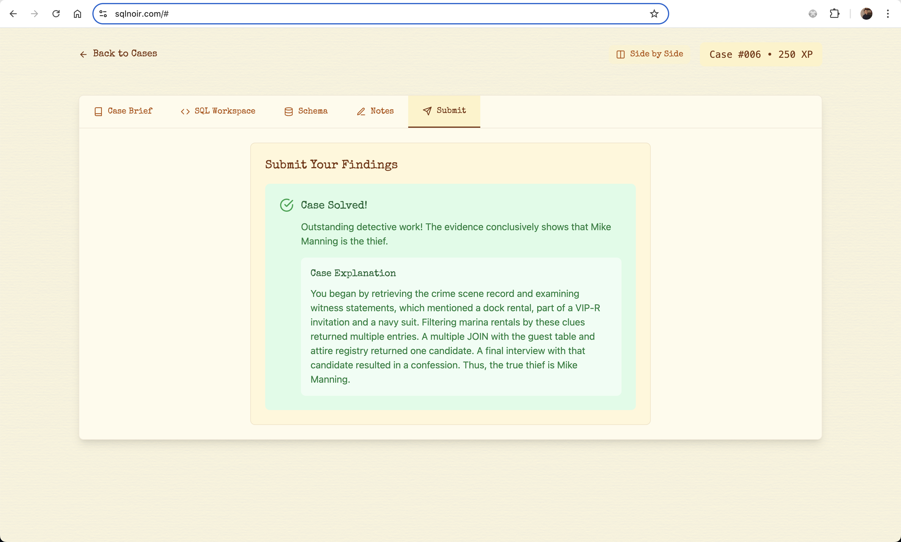

# 🕵️‍♂️ Case #006: The Silocon Sabotage

* **Date:** April 21, 1989
* **Location:** QuantumTech HQ, Miami
* **Crime:** Prototype of the **QuantaX** microprocessor was destroyed, and all research data wiped.
* **Suspected Motive:** Corporate espionage.

## **🗂️ Database Tables Used**

1. incident_reports
2. witness_statements
3. keycard_access_logs
4. computer_access_logs
5. email_logs
6. facility_access_logs
7. employee_records

## **🔍 Summary**



## **🚨 Step 1: Retrieve Incident Report**

```sql
SELECT *
FROM incident_reports
WHERE location LIKE "%QuantumTech%";
```

**Result:**

* **Incident ID:** 74
* **Date:** 1989-04-21
* **Location:** QuantumTech HQ
* **Description:** Prototype destroyed; data erased from servers.

## **🧾 Step 2: Review Witness Statements**

```sql
SELECT *
FROM incident_reports ir
JOIN witness_statements ws ON ir.id = ws.incident_id
WHERE ir.location LIKE "%QuantumTech%";
```

**Key Witnesses:**

* employee_id = 145: *“I heard someone mention a server in **Helsinki**.”*
* employee_id = 134: *“I saw someone holding a keycard marked **QX-XX** (odd two-digit number).”*

## **🔐 Step 3: Track Suspicious Keycard and Server Access**

```sql
SELECT *
FROM keycard_access_logs k
JOIN computer_access_logs c ON k.employee_id = c.employee_id
WHERE k.keycard_code LIKE "QX-%"
  AND CAST(SUBSTRING(k.keycard_code, 4) AS UNSIGNED) BETWEEN 10 AND 99
  AND CAST(SUBSTRING(k.keycard_code, 4) AS UNSIGNED) % 2 = 1
  AND k.access_date = "19890421"
  AND c.server_location = "Helsinki";
```

* **Match Found:** employee_id = 99

## **📧 Step 4: Trace Emails Sent/Received by Employee 99**

```sql
SELECT *
FROM email_logs el
JOIN employee_records er ON el.recipient_employee_id = er.id
WHERE sender_employee_id = 99
   OR recipient_employee_id = 99;
```

* **Employee Identified:** **Elizabeth Gordon**

* **Email Content:** “There might be a potential malfunction near the chip. Thought you should check it out to be safe.”*

### **🕵️ Step 4.1: Dig Deeper — Who Told Elizabeth?**

```sql
SELECT *
FROM email_logs
WHERE sender_employee_id = 263
   OR recipient_employee_id = 263;
```

* **Employee 263:** **Norman Owens**

* **Suspicious Emails (from sender ID NULL):**

* *“L’s schedule puts her close enough. Trigger a minor alert… make sure she logs the visit. That part matters.”*
* *“Unlock 18 quietly by 9. He’ll use his own credentials shortly after L leaves. The trail will lead exactly where it needs to.”*

## **🏢 Step 5: Who Accessed Facility 18?**

```sql
SELECT *
FROM facility_access_logs
WHERE access_date = "19890421"
  AND facility_name LIKE "%18%";
```

* **Employees Logged:**

* **Elizabeth Gordon** (initial visit)
* **Employee 297** (shortly after)

## **🧑‍💼 Step 6: Identify Employee 297**

```sql
SELECT *
FROM employee_records
WHERE id = 297;
```

**Result:**

* **Name:** **Hristo Bogoev**
* **Role:** [Not specified, but likely saboteur]
* **Connection:** Entered Facility 18 shortly after Elizabeth was lured there. Used own credentials.

## **✅ Case Summary**

You started with the **incident report** at QuantumTech HQ and interviewed two key witnesses. One referenced **server access in Helsinki**, while the other saw a **QX-marked keycard** with an odd number. A JOIN between keycard access and server logs on April 21 led to **Elizabeth Gordon**.

She received an email warning her of a chip alarm, prompting her visit to **Facility 18**. Email logs showed that **Norman Owens** (Employee 263) had orchestrated this — having received shadowy instructions to send Elizabeth in and unlock the facility so someone else could enter.

That someone was **Hristo Bogoev**, who accessed Facility 18 after Elizabeth left, using his own credentials. The sabotage was pinned on Elizabeth, but the true culprit was Hristo.

* **🔍 Culprit:** **Hristo Bogoev (Employee 297)**

**Orchestrator:** A mysterious third party who manipulated access via Norman Owens.

**Victim:** QuantumTech’s QuantaX project.

**Motive:** Corporate espionage — carefully staged to mislead investigators.
